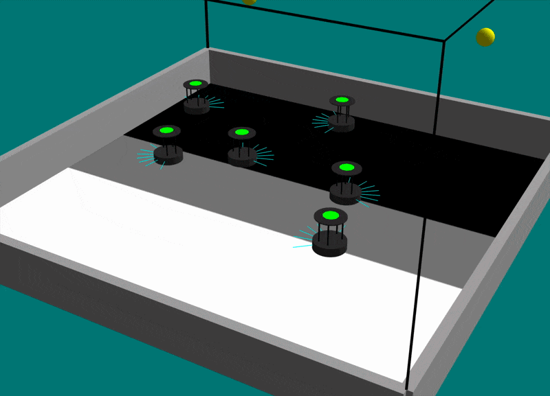

# ARGoS3 TurtleBot 4
This repository contains ARGoS3 plugins for the TurtleBot 4.

<p align="center">
  
</p>

## Prerequisites
- Install ARGoS3 from the official [repository](https://github.com/ilpincy/argos3) so that headers, libraries, and the `argos3` executable are present on your system.
- Optional (but recommended): skim through the [developer manual](https://www.argos-sim.info/dev_manual.php) to understand how ARGoS3 expects plugins to be structured.

## Build and Install
Clone this repository and navigate to the root directory:

### Clone the repository
```bash
git clone https://github.com/CPS-Konstanz/argos3-turtlebot4.git
cd ~/argos3-turtlebot4
```

### Install the plugin
To install the plugin, you can use the helper script or run the commands manually.

- Helper script:
  ```bash
  # configures and builds in ./build (Debug by default)
  ./build.sh           

  # same as above plus sudo make install
  ./build.sh install   
  ```

- Manual steps:

  ```bash
  mkdir -p build && cd build
  cmake -DCMAKE_BUILD_TYPE=Debug ..
  make -j$(nproc)

  # to install libraries/headers into your ARGoS3 prefix
  sudo make install    
  ```

If you prefer running without `sudo make install`, set `ARGOS_PLUGIN_PATH` to `<repo>/build/argos3/plugins/robots/<plugin>` before launching `argos3` so it can find the shared libraries.
```bash
export EXAMPLEDIR=../argos3_plugins/new_robots
export ARGOS_PLUGIN_PATH=$EXAMPLEDIR/build/newepuck
```

## Repository Layout
- `argos3/plugins/robots/turtlebot4`: implementation of the TurtleBot 4 plugin 
- `argos3/testing`: folder contain an example controller, experiment and loop function to test the plugin.
- `build.sh`: convenience script for rebuilding and optionally installing.


## Sensors

### LiDAR
Simulates the TurtleBot 4's 360° LiDAR. Returns an array of distance readings in meters.

- **Range:** 0.01 m – 12.00 m
- **Angular coverage:** 360°
- **Number of readings:** configurable via the `num_readings` XML attribute (e.g. 360 → one reading per degree)
- **Mounting height:** ~0.19 m (lower body + 0.099 m)

### Proximity Sensors / IR
Simulates the 7 infrared intensity sensors arranged in a front half-ring. Each reading is in [0, 1] where 0 means no obstacle and values closer to 1 indicate a closer obstacle.

- **Range:** 0 – 0.2 m
- **Response function:** `exp(-d × 2e / 0.2)` (exponential decay, matches the Create 3 Gazebo model)
- **Sensor positions (angle from robot front, positive = left):**
  - [0] −65°, [1] −38°, [2] −20°, [3] −3°, [4] +14°, [5] +34°, [6] +65°
- **Mounting height:** 0.057 m

### Light Sensors
Simulates three phototransistors that react to `<light>` entities placed in the arena. The reading sums contributions from all visible (non-occluded) light sources.

- **Range:** unlimited — all lights in the arena contribute
- **Response function:** R = (intensity / distance)² per light source; multiple sources are summed
- **Sensors:** 3 — Front-Left, Front-Right, Rear
- **Optional noise:** `noise_level` XML attribute (additive uniform noise)

### Ground Sensors
Reads the floor color beneath each sensor position as a grayscale value in [0, 1] (0 = black, 1 = white). Useful for line following or detecting floor markings.

- **Range:** point measurement — no distance range, reads directly at sensor XY position
- **Sensors:** 4 — Side-Left (6, 14.5 cm), Side-Right (6, −14.5 cm), Front-Left (16, 4.5 cm), Front-Right (16, −4.5 cm), positions in cm relative to robot center
- **Optional noise:** `noise_level` XML attribute (additive uniform noise)

### Omnidirectional Camera
Simulates a downward-looking fisheye camera that detects colored LEDs registered in the `leds` medium. Returns a list of blobs, each described by color, angle, and distance.

- **XY range:** 3.0 m by default; configurable via `max_range` XML attribute
- **Z constraint:** only LEDs with height < 2 × camera elevation (≈ 0.58 m) are detected. This covers typical robot LED rings (≈ 0.375 m) but excludes elevated arena lights (e.g. at 1.5 m)
- **Camera mounting height:** 0.289 m
- **Output per blob:** color (`CColor`), angle in degrees (counter-clockwise from robot front), distance in cm
- **Occlusion:** blocked by embodied entities between camera and LED
- **Note:** the sensor is **disabled by default**; call `m_pcCamera->Enable()` in `Init()` and declare `medium="leds"` in the XML

## Actuators

### Differential Drive
The robot is implemented as a differential drive robot, the example controller provieded (see example) shows how to convert the linear and angular velocity commands into left and right wheel velocities.
This because the real TurtleBot 4 accepts velocity commands in the form of linear and angular velocity, but the ARGoS3 differential drive actuator expects left and right wheel velocities.

### LED
The robot has a LED that can be set to different colors. 


## Run the Sample Experiment
The `testing` folder contains a simple obstacle-avoidance experiment using the TurtleBot 4 plugin. Obstacle avoidance is based only on the proximity sensors.
To run the experiments:

```bash
cd ~/argos3_turtlebot4
argos3 -c testing/experiments/turtlebot4_test.argos
```

## References
- [TurtleBot 4 User Manual](https://turtlebot.github.io/turtlebot4-user-manual/) — official documentation for the TurtleBot 4 platform.
- [ARGoS](https://www.argos-sim.info/) — the multi-robot simulator this plugin is built on.